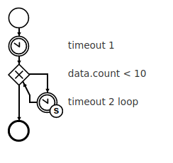
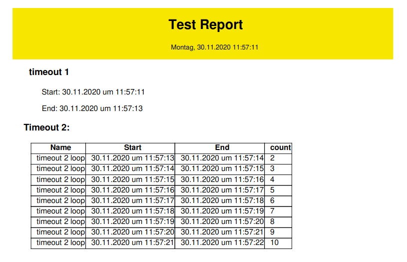

# Report Service
Der Report Service ist ein Logger, der den Eventstream der Cpee verarbeitet und daraus einen HTML und PDF Report erzeugt.

## Endpoints 
Der Service startet auf Port 9321.  
Follgende Endpoints sind verfügbar:


| Pfad       | Beschreibung                                  |
| --------   | --------                                      |
| `/events`  | Verarbeitet Event Stream                      |
| `/report`  | Interaktive Liste der Berichtgruppen (Ordner) |


## Setup
### Dependencies
- Ruby >= 2.7
- APT packages: ruby-dev, wkhtmltopdf [code@github](https://github.com/wkhtmltopdf/wkhtmltopdf), libraptor2-dev, librasqal3-dev
- gems: riddl, pdfkit, cpee, time, date, json, fileutils

### Report mit Prozess verknüpfen
Die Cpee muss den Eventstream des zu dokumentierenden Prozess an den Report Serivce senden.  
Dafür muss in der Prozessbeschreibung (Testset) der Report Service als Handlerwrapper eingetragen werden.  
Beim Laden des Przesses in der Cpee wird der Report Service als Handler registriert.  

Folgendes XML Stück muss eingefügt werden:  
Die url ist die url des Report Service.  
```
<handlers>
  <handler url="https://centurio.work/customers/evva/report/">
    <events topic='activity'>calling,failed,manipulating,done</events>
    <events topic='dataelements'>change</events>
    <events topic='state'>change</events>
  </handler>
</handlers>
```
#### Report
Der Report besteht aus folgenden Teilen:
- Vorlage mit CSS
- HTML Stück für den ganzen Prozess (optional)
- HTML Stücke annotiert bei den Aktivitäten.

Die oben aufgelisteten Teile des Reports sind über URLs im Prozess annotiert.

Weiters wird im Prozess hinterlegt, ob und an wen der PDF Report versendet werden soll. Das E-Mail Attribut beschriebt auch den Inhalt und den Betreff der E-Mail.

##### Aufbau Report
Die Vorlage des Berichts wird als Gundlage verwendet. Dieses HTML muss einen body und einen html Tag (öffnend und schließend) enthalten. Das CSS kann im header verlinkt werden oder direkt im HTML Dokument eingefügt werden.   
In diesem Git Repo ist eine Vorlage, welche einen DIN A4 Report erzeugt. Dieser kann auch schön gedruckt werden (zu PDF umgewanden).  
Nachdem aus der Vorlage ein neuer Bericht erstellt wurde wird das HTML Stück für den ganzen Prozess (init_snippet) eingefügt.  
In init_snippet können Events annotiert werden (siehe Event Annotation). Wenn der Bericht erstellt wurde und das init_snippet hinzugefügt wurde wird auf den Eventstream gehört.  
Wird eine Aktivität, mit einem annotiertem HTML Stück, im Prozess ausgeführt so wird das HTML Stück am Ende des Berichts hinzugefügt.  

#### Prozessattribute Report
Folgende Attribute können in der Prozessbeschreibung (testset) für einen Report hinzugefügt werden:


| Name     | Datentyp | Beschreibung | Optional |
| -------- | -------- | -------- |-------- |
|`report`             |String     |URL der HTML Vorlage                                       |Nein    |
|`report_group`       |String     |Name des Unterordners in dem der Report gespeichert wird.  |Ja      |
|`report_init_snippet`|String     |URL des HTML Stück für den ganzen Prozesses                |Ja      |
|`report_email`       |Hash       |{"to": Email Aressen getrennt durch ';' (String), "subject": Betreff (String),"text": URL der HTML Email oder HTML Text (String) |Ja      |

##### Email report_email
Ist das Attribut `report_email` definiert wird der Report als PDF im Anhang gesendet. Dem Betreff  (`report_email["subject"]`) wird das Datum und die Uhrzeit, wann das Email versendet wird, angehängt (Beipiel: Freitag, 20.11.2020 06:46:22).  
Ein Beispiel für das Email Attribut:
```
{"to": "vt_galvanik_werkerassistenz@evva.com; mathias.hoeller@univie.ac.at", "subject": "Galvanik Nickelbadaufbereitung am ", "text": "https://centurio.work/customers/evva/report/galvanik/email.html"}
```

##### Event Annotation in HTML Stücken

Welche Events (zB: Aktivität wird gestartet/beendet, Datenelemente) im HTML Report mitgeschrieben werden sollen wird in den HTML Stückchen vermerkt.  
Dafür gibt es folgende Regeln (Syntax):
- `%[ID]:TOPIC:EVENT:FURTHER_INFORMATION[:DIG_DEEPER]%` ist die Form einer Annotation im HTML. 
- `ID`: Die ID ist die ID der Aktivität im Testset (a1, a2, ...). Die ID ist optional für HTML Stücke verlinkt an einer Aktivität (obligatorisch im init_snippet). Ist die ID nicht vorhanden wird die ID der Aktivität, an der das HTML Stück verlinkt ist, verwendet. Die ID kann auch auf nachfolgende Aktivitäten verweisen. Somit kann ein HTML Stück mehrere Aktivitäten IDs enthalten. 
- `TOPIC`: Cpee Event Topic. Beispiele: activity, dataelements, state
- `EVENT`: Cpee Event. Beispiele: calling, done, change
- `FURTHER_INFORMATION`: Dieses Element enthält weitere Informationen über das Event. Beispiel: timestamp für den Timestamp des Events. Datenelemente können annotiert werden indem in `FURTHER_INFORMATION` der Name des Datenelement angegeben wird. 
- `DIG_DEEPER`: Datenelemente können tiefer Annotiert werden. Beispiel: Das 3. Element aus einem Datenelement mit dem Datentyp Array soll in den Report aufgenommen werden. Hierfür ist `DIG_DEEPER = 2`.  

###### Beispiel:
```
<div>
  <p>Nachname: %:dataelements:change:person:name:1%</p>
  <p>Aufgerufen am %:activity:calling:timestamp%</p>
  
</div>
```
Das oben angeführte HTML ist bei der Aktivität mit der ID: a2 verlinkt.

`%:dataelements:change:person:name:1%`: A2 ruft einen Service auf, der folgendes Datenelement retuniert: `{'name': ['Mathias', 'Hoeller'], 'city': 'Vienna', 'id': 12345}`. In den Report wird der Nachname (zweites Element in 'name') aufgenommen.  

`%:activity:calling:timestamp%` wird mit dem Zeitpunkt, an dem der Service aufgerufen wird, ersetzt.

`%a3:dataelements:change:imagelink%`: A3 ruft den Mitarbeiterservice auf und retuniert einen Link zu dem in der Datenbank hinterlegten Bild des Mitarbeiters (`"www.daslebenisteinponnyhof.org/mitarbeiter/12345/image"`). Dieser wird in das HTML eingefügt. Somit steht im HTML Report `` und das Bild wird im Report dynamisch geladen. Aus diesem Grund ist es wichtig, dass der Link beim Aufruf des Berichtes erreichbar ist. Für das Umwandeln in ein PDF muss der Link auch vom Report Service aufgerufen werden können.

Das HTML Stück nach dem erfolgreichen Aufruf von A2 und A3:
```
<div>
  <p>Nachname: Hoeller</p>
  <p>Aufgerufen am 11.11.2020 um 11:11</p>
  
</div>
```


##### Const Annotation für Schleifen 
Die `Const` Annotation ermöglicht die dauerhafte Aufzeichung eines Events über die Laufzeit des Prozesses. Dies ist zum Beipiel hilfreich, wenn eine Aktivität in einer Schleife aufgerufen wird und die wiederkehrenden Events der Aktivität in einem einzigen HTMLStück zusammengefasst werden sollen. Somit kann eine Tabelle erzeugt werden, die einen Schleifenduchlauf in jeder Zeile darstellt.  
**Dazu follgendes Beispiel:**
Der Prozess besteht aus zwei timeout Aktivitäten (`a1`, `a2`), wobei die zewite Aktivität `a2` in einer Schleife aufgerufen wird. Der Report soll das Label und den Start und Endzeitpunkt von `a1` beinhalten und alle Aufrufe von `a2`, mit Start-, Endzeitpunkt, Schleifenzähler und Label, in einer Tabelle darstellen.  
###### Prozessmodel

###### Bericht

###### Testset
Das dazugehörige Testset ist [hier](./email_test/test_email_report.xml). Im Ordner [test_email](./email_test/) sind das [Testset](./email_test/test_email_report.xml), das [E-mail HTML](./email_test/email.html), das [HTML Stück](./email_test/timeout.html) und das Bericht [HTML](./email_test/report.html)/[CSS](./email_test/report.css).